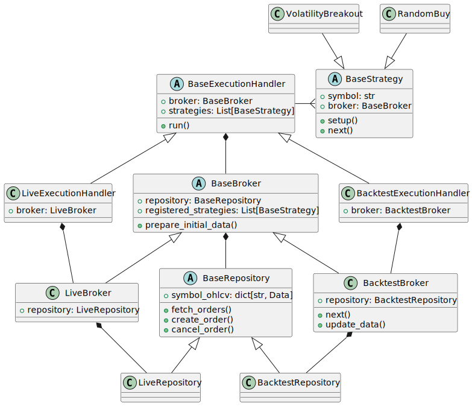
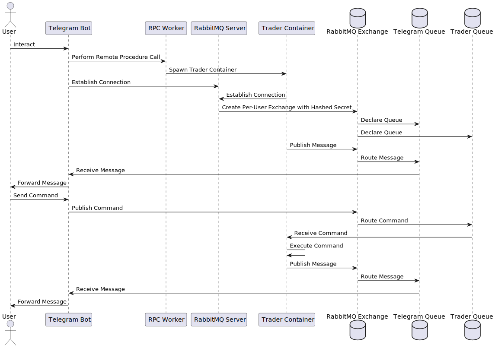

# ChartRider <!-- omit in toc -->

- [Prerequisites](#prerequisites)
- [Installation](#installation)
  - [Dependencies](#dependencies)
  - [Pre-commit hooks](#pre-commit-hooks)
- [Local Configuration](#local-configuration)
- [RabbitMQ Initialize](#rabbitmq-initialize)
- [Project Structure](#project-structure)
  - [Design Documentation](#design-documentation)
    - [Class Diagram](#class-diagram)
    - [Sequence Diagram](#sequence-diagram)
  - [Folder Hierarchy](#folder-hierarchy)
- [Disclaimer](#disclaimer)


## Prerequisites

- Python version 3.11 and above is required.
- Install [Poetry](https://python-poetry.org/docs/#installation) package manager to install all the dependencies.
  - On certain platforms (e.g. Windows), you may want to set `export PYTHON_KEYRING_BACKEND=keyring.backends.null.Keyring` before installing poetry.
- Install [TA-LIB](https://github.com/TA-Lib/ta-lib-python) binary for technical analysis. You can follow the instructions in the README of the repository.

## Installation

### Dependencies

Run the following command to install all the dependencies:
```bash
# create .venv folder in your project
poetry config virtualenvs.in-project true --local
# install required dependencies
poetry install
```
The above command will install all the required dependencies in a virtual environment.

### Pre-commit hooks

This repository uses pre-commit hooks to ensure consistent code quality. To install pre-commit hooks, run the following command:

```bash
pre-commit install
```

## Local Configuration

We utilize PostgreSQL for persistent storage of OHLCVs, TP/SL data, and more. To initiate the local PostgreSQL environment, execute the following command:

```bash
docker-compose -f docker-compose.local.yaml up -d
```

> **Note** \
> To pull the images from the AWS ECR, you need to have the AWS CLI installed and configured with the necessary permissions.
>
> To authenticate Docker to an Amazon ECR registry, run the following command:
> `aws ecr get-login-password --region ap-northeast-2 | docker login --username AWS --password-stdin 542695926028.dkr.ecr.ap-northeast-2.amazonaws.com`

Keep the service running during testing; it's required for database interactions.

## RabbitMQ Initialize

We use RabbitMQ as a message broker to bridge telegram and live trading system. To run RabbitMQ container locally:

```bash
docker run -d --name chartrider-rabbitmq -p 5672:5672 rabbitmq:latest
```

## Project Structure

The project structure of Chartrider is organized into the following directories:

### Design Documentation

The `docs` directory contains some resources that will provide an overview of the relationships between the different components of the system.

#### Class Diagram



#### Sequence Diagram




### Folder Hierarchy
The `chartrider` directory contains the source code for the project. It is organized into the following subdirectories:

- `core`: Contains the core components of the trading system, such as the broker, execution, repository, and strategy modules.
- `data`: Contains the data-related components, such as the downloader and schema modules.
- `reports`: Contains the stat and plot modules.
- `strategies`: Contains the trading strategies.
- `telegram`: Contains the telegram bot module.
- `tests`: Contains the unit tests for the project.
- `utils`: Contains the utility modules, such as data, exceptions, exchange, misc, secrets, and timeutils.
- `backtest_settings.py`: Contains the configuration settings for the backtesting module.
- `settings.py`: Contains the configuration settings for the project.

Note that the project is still under heavy development, and the structure is subject to change.

## Disclaimer

This repository and its contents are proprietary software, exclusive to our organization. The software and all associated code, documents, and assets are proprietary and confidential. The software is not licensed for distribution, copying, modification, or use outside of our organization. Unauthorized access, copying, distribution, or use of this software is strictly prohibited.
